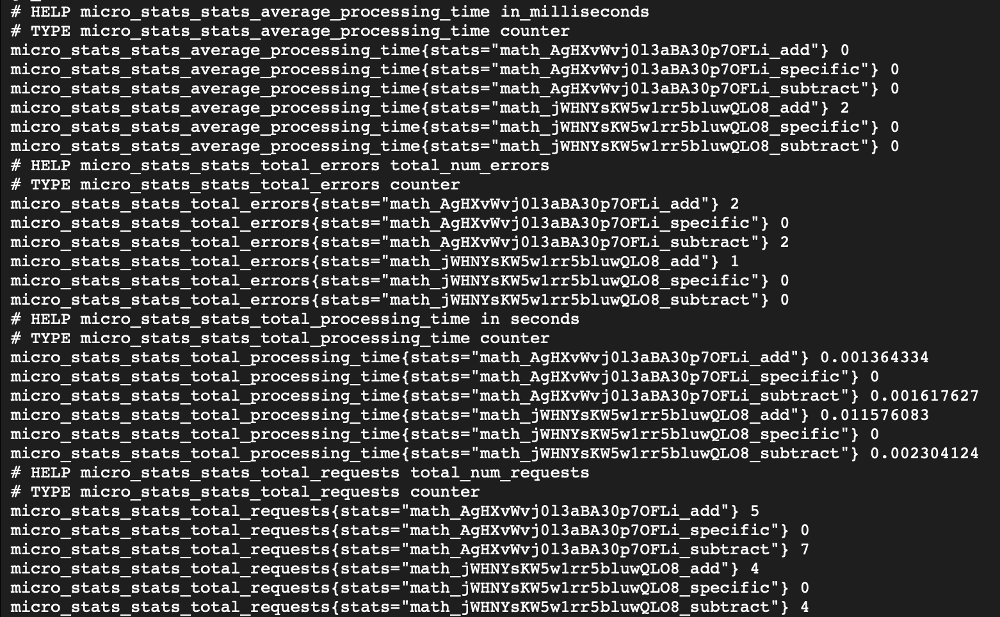

# NATS Micro exporter

## Description

Prometheus exporter to scrape NATS micro stats

## Options
| Option          | Description               | Default               |
| --------------- | ------------------------- | --------------------- |
| name            | NATS connection name      | micro-exporter        |
| port            | metrics webserver port    | 10015                 |
| server          | server URLs               | nats://localhost:4222 |
| creds           | path to credentials file  |                       |
| jwt             | user JWT                  |                       |
| seed            | user seed                 |                       |
| scrape-interval | scrape interval (seconds) | 15                    |

> will try to use NATS context if no auth is passed

